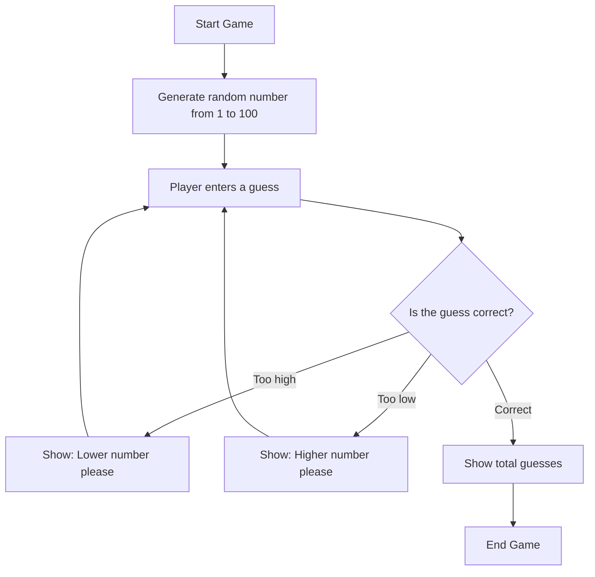

# Random Number Guess Game


```
=====================================
       Random Number Guess Game
=====================================
I picked a number between 1 and 100.
Can you guess it?

Enter your guess: 50
Higher number please!

Enter your guess: 75
Lower number please!

Enter your guess: 63
Congrats! You guessed the number in 3 guesses.
```

## Project Preview



## Features

- Generates a random secret number between `1` and `100`
- Gives helpful hints after every wrong guess
- Counts how many attempts the player used
- Handles invalid non-number input
- Runs directly in the terminal

## What I Learned

This project practices C basics like variables, loops, conditionals, random number generation, user input, and simple terminal interaction.
